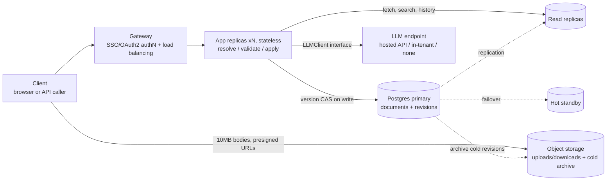

# Part II: Production infrastructure

## Architecture & Infra

- **Compute:** N identical stateless FastAPI replicas behind the gateway; no state in the process, so any replica serves any request. The repository interface means the Postgres swap never touches a route handler.
- **Storage:** Postgres mirrors the domain model: `documents` plus append-only `revisions`. The version gate becomes a compare-and-swap UPDATE; zero rows updated means another writer won, and the loser gets the same 409 the prototype returns.
- **Caching:** revisions are immutable, so any pinned version's text can be cached indefinitely; nothing ever invalidates it. The current version number must never be served stale: the 409 gate reads it inside the write transaction.
- **Object storage:** 10MB bodies stream via presigned URLs instead of buffering through the app tier. v1 stores full text per revision; delta encoding is a deferred refinement.

## Security & Compliance

- **Auth:** authentication at the gateway (SSO/OAuth2); authorization in the app, tied to the verified identity: tenant isolation plus matter-level permissions. TLS in transit, per-client keys at rest.
- **Two logs, two purposes:** the revision log (built in Part I) audits what documents became and on whose instruction; production adds an actor field. A separate access log records every interaction, reads included: who read a document matters as much as who changed it.
- **GDPR vs. append-only:** erasure usually yields to legal-hold and legal-claims carve-outs; when it does not, deletion becomes a recorded act: a tombstone removes content and keeps the audit skeleton. Retention is a per-client seam.

### Deployment models for legal clients

- **Multi-tenant SaaS** for smaller clients; **single-tenant VPC** for big law and regulated clients: the entire stack deploys inside the client's own cloud account. The stateless tier and interface seams make this a deployment choice, not a fork.
- **When documents cannot leave the tenant,** the model comes to the documents: an in-tenant endpoint behind the same `LLMClient` interface. The trust dial: SaaS with hosted API, VPC with in-tenant model, VPC with no LLM (the shipped default). Identical codebase at every notch.
- **Provenance:** proposal ids are client-asserted in Part I; production signs and verifies them on the apply path.

## CI/CD & Deployment

- **Pipeline:** lint, unit suite (58 tests, under a second), benchmark tier as a performance regression gate, build, ship. On 10MB documents performance is a correctness property: a quadratic regression fails CI, not a client.
- **Rollout:** rolling, one replica at a time; no downtime. Old and new code coexisting is safe on two legs: stateless replicas, backward-compatible migrations. Rollback is redeploying the previous image.
- **Migrations:** additive first. Append-only revisions mean history is never rewritten, so no backfills; risk concentrates on the small mutable `documents` table.

## Scalability & Resilience

- **Scaling:** add replicas freely; Postgres is the only stateful piece, so it is the bottleneck. Reads (fetch, search, history) offload to read replicas; the writer handles only PATCHes, and contracts are not edited a thousand times a second.
- **Resilience:** hot standby promotion for machine death; cross-region backups for disaster. Committed revisions survive failover: downtime means no updates, not lost updates.
- **Search:** the scan measures ~49ms per phrase query over 10MB. The forcing axis is corpus size and query volume: graduate to Postgres full-text search (phrase-capable, nearly free once documents live in Postgres), then OpenSearch only if corpus or ranking demands it. Vector search answers a different question (semantic similarity) and is a future feature, not this scaling path.
- **LLM outage, batching:** an outage breaks exactly one endpoint; propose returns 502 and nothing else notices. The mock is never a production fallback: canned proposals presented as model output are the silent guess this design exists to prevent. Batching is already the API's shape: one PATCH, N changes, one validation pass, one revision.

## Monitoring & Observability

- **Dashboard:** Postgres up; writes per second and their success rate; LLM 502 count.
- **Rejection rates by reason are product telemetry:** rising 409s mean teams are colliding (take real-time collaboration seriously); rising ambiguity 422s mean users need better targeting tools, such as a UI on the candidate list the API already returns.
- **Propose/apply join:** `proposal_id` links both calls; proposals with no matching PATCH are the abandonment rate, a quality score on the LLM feature.
- **Alerting: page on what we can act on.** PATCH errors wake an engineer; an LLM provider outage waits for morning.

## Operations & Cost

- **LLM calls dominate cost:** the whole document ships per propose, billed by token. Control knob: send only the section under review, safe because validation does not trust the model.
- **Single region by default,** for cost and consistency; a second region only when a client's data residency demands it. VPC clients already scatter risk across their own clouds.
- **Archive, never delete:** cold revisions compress to object storage, with a pointer kept in Postgres. History stays complete; only the storage bill changes.

## Seam mapping: Part I code → production counterpart

| Seam in this repo | Where | Production counterpart |
|---|---|---|
| `DocumentRepository` interface | `app/repository.py` | Postgres (documents + revisions tables, transactional version bump) |
| Append-only `Revision` log | `app/repository.py` / `app/models.py` | Append-only audit store: partitioned revisions table, WORM/retention policy per client |
| Optimistic concurrency (`expected_version` → 409) | `app/routes.py` | `UPDATE … WHERE version = ?` compare-and-swap; no app-level locks |
| Linear-scan search | `app/search.py` | Postgres FTS (`phraseto_tsquery` for phrase queries) → OpenSearch when corpus/ranking demands |
| `LLMClient` protocol (mock / Anthropic) | `app/llm.py` | Provider abstraction; per-client model choice, in-tenant endpoints where required |
| Client-asserted `proposal_id` | `app/routes.py` | Signed proposal identifiers, verified on the apply path |
| Error envelope handlers | `app/errors.py` | Gateway-level error contract, consistent across services |
| `MOCK_LLM` / env config | `app/llm.py` | Secrets manager + per-environment config |
| In-process state | `app/main.py` | Stateless app tier; all state in the data layer → horizontal scaling |
